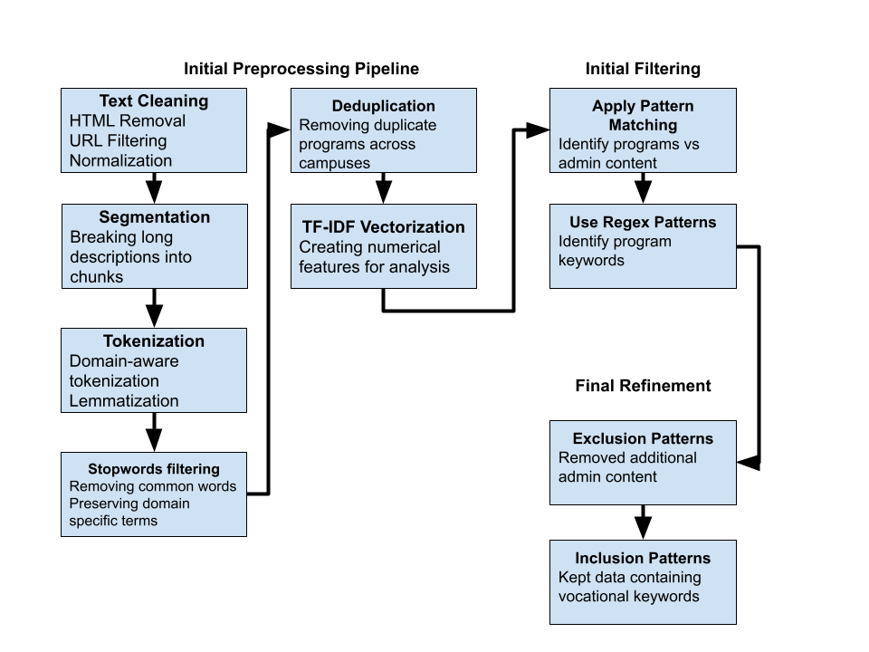
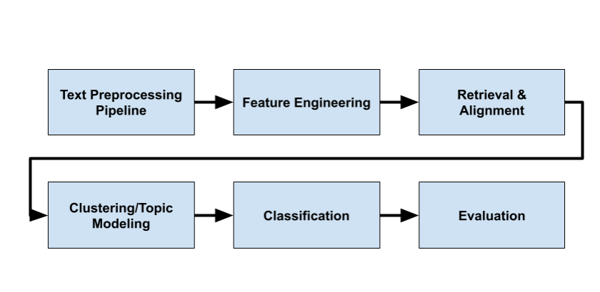
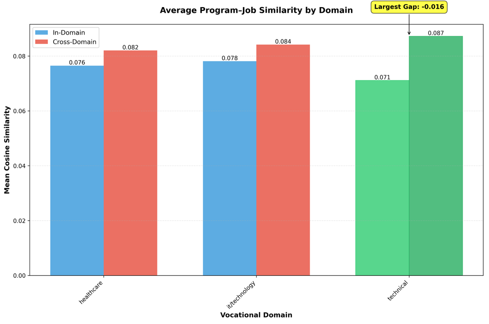
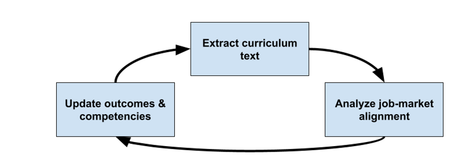

# A Semantic Comparison of Job Postings and Vocational Program Descriptions

**Analysis of employer demand and educational offerings from career-oriented institutions**

**Marco Siliezar1,2,†**  
1 Northwestern University  
2 <https://www.linkedin.com/in/marcosiliezar/>  
† marco.siliezar@gmail.com  

---

## Abstract

One of the major problems institutions face in assessing the value of vocational programs is that aligning their outcomes with the needs of employers is a manual process. Program administrators manually review job postings, employer feedback, and program catalogs. This process is time-consuming and difficult to complete. Yet vocational schools play a critical role in preparing learners for immediate workforce entry. Institutions need scalable methods to assess whether their curricula align with evolving labor market needs. This creates a need for automated techniques that can systematically analyze large volumes of unstructured text from both online job postings and online program descriptions. Applying a TF-IDF-based feature fusion model to a dataset consisting of online job postings and program descriptions from institution websites is effective at retrieving the most relevant job postings for a given vocational program description using text similarity. This approach performed best at this task compared to Word2Vec, Doc2Vec, and other feature fusion configurations. The healthcare domain demonstrated the strongest alignment between programs and job postings compared to technical and technology domains. For institutions, this research recommends ongoing curriculum review on low-alignment domains to ensure program outcomes match labor market wording. Applying a multi-stage filtering pipeline to improve corpus fidelity and expanding data coverage are suggestions for future work.

**Keywords:** Job-curriculum alignment; semantic similarity; information retrieval; TF-IDF feature fusion; Doc2Vec embeddings; vocational education

---

## Table of Contents

- Abstract  
- Introduction and Problem Statement  
- Literature Review  
- Data  
- Methods  
- Results  
- Discussion  
- Conclusions  
- Directions for Future Work  
- Acknowledgements  
- Data Availability  
- Code Availability  
- References  
- Appendix A  

---

## Introduction and Problem Statement

In recent years, there has been an increased focus and priority in the United States towards career-focused postsecondary education and away from traditional “liberal arts” education due to questions about the value of the latter. The argument is that vocational education offers a lower-cost, faster path to gainful employment. But this is under the assumption that these institutions can teach and train learners in a way that meets job market demands. Are vocational institutions truly ensuring career readiness? Certainly, they are not (and cannot) guarantee it. Therefore, it is important for them to stay well-informed of current market trends and adjust their curriculum accordingly to ensure their students obtain the necessary skills and competencies required in the job market, to find jobs, pay back their loans, and positively impact society. Based on this author’s observed evidence, the common approaches institutions take to solve this problem is through a combination of hiring consultants and performing manual cursory job market search. This approach is inefficient and costly.

Although the increasing availability of labor-market data and educational analytics has advanced the understanding of program outcomes and student behavior, relatively few studies have taken a data-driven approach to curriculum design that directly aligns job-skill demand with course content. For example, Müller (Müller 2023) used job-ad analytics for curriculum alignment in information systems programs of study, and Wang and Feng (Wang and Feng 2023) proposed big-data-based course design methods for vocational education. Thus, comprehensive empirical frameworks for linking job-ad skill extraction to vocational curricula remain limited. This study addresses the gap for vocational programs, specifically in California. By extracting job skills from Adzuna.com job postings, extracting curricular content through institutional program web scraping, and quantitatively comparing them using overlap and semantic similarity metrics, this research attempts to identify alignment between skills from labor-market data with skills articulated in vocational curricula.

---

## Literature Review

The digitization of labor-market data has accelerated research (into the 2020s) on how natural language processing (NLP) can highlight the relationship between workforce demands and educational programs. Studies of job posting data now represent a significant topic within NLP, focusing particularly on skill extraction, which is the automated process of identification and normalization of skills from unstructured text. Although there have been methodological advances in this area, relatively little attention has been paid to how extracted skills align with vocational curricula, particularly within a geographical context such as a U.S. state. California has always given importance to data-driven alignment in this regard, so this gap in research is notable.

### Skill Taxonomies

The most widely adopted occupational taxonomy in the U.S. is the the Occupational Information Network (O*NET), maintained by the Department of Labor. The O*NET Content Model organizes information into six domains encompassing worker characteristics, requirements, and job-specific skills (National Center for O*NET Development 2023). O*NET has become the de facto framework for mapping skills to standardized occupations, underpinning studies of labor-market trends and educational program relevance (Altstadt 2011; Atwell 2022). Among the taxonomy, this framework includes task statements by occupation title. For example, for Medical Assistants, one of the task statements is the following: “Greet and log in patients arriving at the office or clinic.”

### Skill Extraction

Recent work has advanced the technical methods for extracting and classifying skills from job postings. Gugnani and Misra (Gugnani and Misra 2020) used embedding-based representations to infer implicit skills inferred from contextual cues. Zhang (Zhang et al. 2022) introduced SkillSpan, a benchmark dataset and BERT-based baseline models that treat hard and soft skills as span-level entities within text. Industrial implementations, such as LinkedIn’s Job2Skills system (Shi et al. 2020), demonstrate how weak supervision and large-scale data can be combined to operationalize skill extraction in production environments. These works establish the methodological baselines and evaluation protocols that inform this project’s extraction pipeline. Complementing these modeling advances are survey studies that synthesize the state of the field. Senger (Senger et al. 2024) provides a comprehensive review of deep learning-based skill extraction and classification, cataloguing the evolution from keyword-based approaches to transformer architectures.

### Education–Workforce Alignment Research

At the policy level, research by Altstadt (2011) and Atwell (2022) demonstrates the importance of aligning community-college programs to labor-market demand. Yet this research relies primarily on descriptive labor statistics rather than computational analysis. The California Community College LaunchBoard similarly integrates labor-market information into program evaluation dashboards but does not directly employ text analytics.

In contrast, a small but emerging body of work applies data-driven methods to curriculum design and optimization. Müller (Müller 2023) proposed a framework that leverages job-ad analytics to align course content with labor-market trends. That study demonstrates how unstructured employment data can inform curricula enhancements by identifying in-demand competencies missing from course offerings. Although the research was conducted in the context of information systems education, the approach is an example of text mining techniques like those used in this project.

In the context of big-data optimization, findings emerged when exploring strategies for vocational course design in China (Wang and Feng 2023). That study used student behavior and performance data to refine learning material, illustrating how data analytics can enhance vocational education. Unlike Müller’s focus, however, Wang and Feng’s approach focuses on educational data streams. Together, these studies emphasize the importance and potential of data-driven frameworks to support curriculum enhancements. At the same time, these studies highlight that research on integrating labor-market signals with program content remains rare.

### Program Description Extraction

Trafilatura is a tool specifically designed to extract main content and remove boilerplate, specifically from heterogeneous HTML structures. The initial Trafilatura paper (Barbaresi 2021) cites superior performance in benchmarks versus alternatives. To extract content from program websites, this study employs this text extraction framework. Compared to general HTML parsers (Richardson 2025), the initial paper showed higher precision in isolating article-level text and metadata.

### Summary and Research Gap

Together, these strands of literature—labor-market skill extraction, program-description extraction, and education–workforce alignment—define the boundaries of the current research landscape. The former provides mature NLP methods and taxonomic infrastructures for identifying and categorizing skills, while the latter contributes to emerging techniques for structuring unstructured educational data. Yet no published study to date directly evaluates how well the skills extracted from California job postings correspond to the competencies articulated in vocational curricula. This research looks to fill that gap by aligning skill extraction from job postings with catalog-level program curriculum parsing, thereby providing an empirical measure of curriculum–labor alignment.

---

## Data

A popular website that offers job seekers a search engine for online job postings is Adzuna.com (Adzuna 2023). It also offers an API with several endpoints, one of which was used to retrieve job advertisement listings for this research. These listings provide a job title and a job description for each posting from which skills were extracted.

A targeted search approach was used to retrieve 1,000 available vocational jobs within the U.S. state of California between October 1, 2025, and October 13, 2025. This approach allows a focused search of jobs that would be target careers of vocational school learners. This geographic location was chosen to get solid coverage while aiming for a manageable-sized job posting corpus. Most of the time preprocessing this data was spent on removing noise like boilerplate information and general advertisement verbiage that is generally included in job descriptions. Figure A1 shows an example of a job posting with significant boilerplate information in its job description, compared to Figure A2, which more directly describes its job requirements. These are examples of the variability present in the job posting corpus. Note that both examples are posts for the same occupation.

The program curricula corpus was created through a multi-stage process involving web scraping, preprocessing, and filtering. Web scraping (Scrapy 2025) was done to extract program curricula across the following random choice of five California-based vocational institutions: UEI College, American Career College, Universal Technical Institute, Glendale Career College, and Southern California Institute of Technology. Across these schools (all of which have locations throughout the state), a total of 131 programs and their course descriptions were obtained. The web scraping process stored each program into the following data structure: school name and domain; program name and description (raw HTML + cleaned text); award type (diploma, certificate, associate degree, etc.); campus location; source URL and type.

A data preprocessing pipeline (Figure 1) was developed to filter the program corpus for only program descriptions and course details and remove boilerplate, marketing information, FAQs, and other non-program content. It takes raw data and transforms it into clean, tokenized, and vectorized data that can be used for machine learning modeling, text analysis, and feature extraction.

---

## Methods

To find the artificial intelligence models that performed best at embedding, clustering, and topic modeling the corpora, traditional machine learning with modern transformer methods was built using Python. Text features were represented through multiple embedding methods: TF-IDF, Word2Vec, Doc2Vec, and transformer-based sentence embeddings. Configuration was handled via YAML files with artifacts stored in Parquet format. A comprehensive NLP system was produced for classifying and analyzing vocational job postings for this research. The end-to-end NLP algorithm workflow includes six steps (Figure 2) and is described next.

### Text Preprocessing Pipeline

The preprocessing pipeline was applied consistently to both corpora. Normalization of text was performed to normalize casing, Unicode, and remove unnecessary punctuation, URLs, and HTML artifacts. Segmentation of text provided easy inspection, and word tokenization was generated using whitespace and punctuation rules. Lemmatization was included in this step; however, light stemming was intentional to preserve interpretability of technical terms in both corpora given its domain-specific text. Stop word removal was done using spaCy (Explosion 2025). This was extended with domain-specific stop words for common but uninformative terms such as “program,” “student,” and “job,” based on corpus frequency analysis. Lastly, section extraction was performed on job postings to split them into logical sections which were later fed into section-aware features.

### Feature Engineering

Vocational education and the vocational trade industry is full of specialized jargon; words such as “apprenticeship,” “journeyman,” and “medical assistant externship” are commonly found in both program descriptions and job posts in their respective industries. Character 3-grams and 5-grams were created for robustness to catch minor spelling variants and morphological variants for words like “phlebotomist” and “phlebotomy.” For each corpus, several TF-IDF vector spaces were built, and pruning of less frequent n-grams was done with the goal of catching important phrases such as “sterile processing” and removing less valuable ones such as “student.” Details on TF-IDF thresholds used are in the Appendix.

To further focus on skills in job posts, experimentation was done to compute TF-IDF vectors for sections of job postings to test whether aligning programs to specific job post sections improved retrieval. An unsupervised approach was taken, and O*NET data was not used. Details on the sections and section-aware schema weights are in the Appendix.

### Similarity Computation and Feature Fusion

A sub-section of feature engineering calculates a cosine similarity matrix (that can be used in the next step of the pipeline) to identify alignment and retrieve the top-k aligned job set for a given program. The cosine similarity is calculated as follows. First, for any given program and job, the cosine similarity is calculated. Next, these similarities are combined via a late-fusion weighted sum of each feature space’s word, character, and phrase similarities. The result is then treated as a ranker to be fused with BM25 via RRF (best matching 25 via reciprocal ranked fusion) to give the final fused score. This is an application of the standard RRF algorithm (Robertson 2009).

### Retrieval & Alignment

The pipeline takes the final fused score for each program for all jobs, ranks them and takes (retrieves) the top-k jobs as the aligned job set for that program. An additional experiment was conducted here to analyze alignment solely on the healthcare subdomain. The job post corpus was healthcare-heavy, so a special focus on it was of interest. This retrieval-based perspective is the core of how alignment is operationalized in this research.

### Clustering and Topic Modeling

To better understand the structure in the data and cross-check retrieval behavior, classification, clustering, and topic modeling were applied. The modeling system takes the following approaches:

1. **Clustering algorithms** – including K-Means, hierarchical, DBSCAN, and agglomerative clustering. These algorithms were evaluated using the following post-clustering metrics: Silhouette, Calinski-Harabasz, and Davies-Bouldin scores. Clustering provided interpretability and a way to sanity-check whether retrieved jobs occupy similar regions of the feature space as the programs to which they are aligned.

2. **Topic modeling** – Latent Dirichlet Allocation (LDA) was run, and the quality of the topics it generated was measured using context vector coherence. Different values of *k* (*k* = 5, 8, 10, …, 30) were used to evaluate model performance and to identify thematic topics.

3. **Classifiers** – Logistic Regression, Random Forest, Support Vector Machine, and Multinomial Naive Bayes were performed. These classifiers were used to predict healthcare versus non-healthcare programs and jobs, and clinical versus administrative jobs within the healthcare domain.

4. **Evaluation** – Intrinsic semantic tests were performed for embedding coherence and cross-validation for model stability. Labeled data was not used to objectively measure the quality of these algorithms at achieving the downstream goal. Thus, intrinsic and extrinsic evaluations were performed. Intrinsic evaluations assessed the quality of embeddings while extrinsic evaluations tested program–job retrieval performance. Together, these metrics provide a full view of the system’s performance.

### Classification

Domain classification allowed the creation of ground-truth labels for program data and job data that is used for evaluation in the last step of the pipeline. Each program and job was tagged with a broad domain label (Healthcare, Technical/Trade, Business, IT, Other) via a manual mapping using a keyword-based heuristic. Keywords were derived from program titles and industry vocabulary (e.g., “medical,” “HVAC,” “business”) and validated manually. This rule-based approach provided reliable domain categories whose similarity can then be calculated. For each domain, a mean similarity was computed for both same-domain pairs and cross-domain pairs. The gap between the mean in-domain and mean cross-domain is also calculated.

### Evaluation

Retrieval is the primary task of this pipeline. To evaluate effectiveness, retrieval metrics were calculated and evaluated. For each program, a Precision@5 (P@5) metric is used to consider only the top 5 retrieved relevant jobs and the Mean Reciprocal Rank (MRR) metric was used to measure the performance of this system in identifying the top relevant jobs. This evaluation step compared all TF-IDF setups, the feature fusion model, and the BM25/RRF hybrids. Lastly, classification was evaluated with F1 for precision and recall on healthcare and subdomain labels while clustering was evaluated with Silhouette scores and inspection of cluster contents. The goal of these secondary metrics was to help validate that the feature space was coherent and that retrieval behavior made sense considering both supervised and unsupervised structure. The feature fusion configuration showed the best retrieval performance as it improved P@5 and MRR over the baseline, and that model was used for the main alignment analyses.

---

## Results

In this section, the results of experimentation and the final pipeline runs are discussed. The final pipeline configuration that most accurately retrieved relevant jobs for programs was the TF-IDF-based feature fusion model with embeddings loaded from a Doc2Vec (PV-DM) model (see Figure 3). This final configuration uses word 1–2 grams, character 3–5 grams, and phrase tokens (threshold = 7) with section weighting. Feature fusion achieved better precision than section-aware features as they were feasible but incomplete. Table A.1 shows a summary of all experiments and their results. Discussion on final pipeline parameters is in the Appendix. Coverage gaps, particularly in outcome sections, limited retrieval performance; full results are included in the Appendix.

The first run of the final pipeline configuration resulted in an order-of-magnitude difference in similarity between the top programs (0.59) and the bottom programs (0.04). Among the top programs, there is strong, clean lexical and semantic match. However, it is observed that every top 5 retrieved job is for a pharmacy technician. Shared terms between the top programs and top jobs include “pharmacy,” “technician,” “pharmacist,” “dispense,” “prescription.” This means the pipeline correctly identifies that this program’s curriculum maps directly to a well-defined job family. This is an example of clear curricular–occupational alignment. The low similarity scores of the bottom programs are a result of weak and noisy text. For example, for a physical therapy assistant program, the top jobs aligned by the model were administrative roles such as office manager and roles with “billing” in their title. This reveals data coverage gaps.

To refine the alignment, the following additional steps were taken. First, programs were deduplicated. The top-aligned list repeats the Pharmacy Technician program due to the same title being listed. Thus, only the first occurrence is kept. Second, to reduce noise, non-program and metadata rows were removed as these were skewing results. Third, very short descriptions with less than 50 words were removed as they lack enough signal; therefore, minimum text length was enforced. Lastly, a healthcare-only subdomain test was performed to confirm whether the model can differentiate between clinical and administrative roles within the same industry. Only the “Healthcare” domain label was kept, and a simple keyword split was created.

To determine whether programs and jobs in the same domain have strong similarity compared to programs and jobs across domains, the difference between them—the gap—is calculated. The mean similarity scores are in the expected range for a sparse corpus of this size (Manning 2008) with normalized cosine scores. The difference between mean in-domain score and the mean cross-domain score, the gap, was a negative number for each domain. This means that cross-domain pairs (program and job pairs in different domains) were slightly more similar on average than same-domain pairs. As shown in Figure 4, the largest gap is in the technical domain, and the smallest gap is in the healthcare domain. This means that healthcare remains the best-aligned domain.

Table 1 shows examples of top aligned program–job pairs. As shown, the pipeline correctly identifies alignment when there is strong term overlap between program names and job titles, for example, “medical” with “surgical,” “pharmacy” with “technician.” However, domain labels were misaligned in some cases. This explains why some programs show 0% alignment concentration even when their top jobs are correct. The pipeline results demonstrate that the deduplication and filtering worked. Similarity values are more evenly distributed. The in-domain versus cross-domain similarity gap shrank, meaning that the corpus is more homogenous post-cleaning. Even though the overall averages are low (mostly around 0.07 as shown in Figure 4) the top aligned examples now show a mean Top-5 of at least 0.30, indicating successful discrimination.

**Table 1. Top-Aligned Programs**

| Program/Top Job Example Pair                       | Domain        | Mean Top-5 | % of Top 5 jobs in the same domain |
| -------------------------------------------------- | ------------- | ---------- | ----------------------------------- |
| Medical Assistant Diploma / Medical Assistant      | Healthcare    | 0.3232     | 100%                                |
| Welding Diploma / Engineering Supervisor           | Technical     | 0.26       | 0%                                  |
| Nursing Associate / Paralegal                      | IT/Technology | 0.22       | 20–100%                             |

### Healthcare Subdomain Alignment

The healthcare subdomain alignment test proved that the model could distinguish fine-grained occupational subdomains within healthcare. The corpus is clinically focused however, and no administrative programs surfaced. There are three likely causes for this. Most institutions in this research emphasize hands-on clinical programs. Administrative programs such as billing, coding, and health office often use terms like “office administration” and may have been tagged under a different domain. The administrative keyword list may be too narrow, missing variants like “health information management” or “medical office specialist.” This is a data-coverage issue.

As shown in Table 2, the embeddings reward specific and specialized skill language and penalize generic program text. This is how a content-based alignment model should behave (Manning 2008). The subdomain pipeline is validated by the following evidence. The feature fusion embedding successfully distinguished subdomains within one industry. The keyword-based subdomain tagging was consistent as clinical programs matched clinical jobs at least 70% of the time. The small cross-subdomain leakage (roughly 0.8 mean Top-5 admin matches to program) reflects natural lexical overlap rather than misclassification. This evidence suggests semantic granularity as the pipeline goes beyond surface domain labels and captures contextual job distinctions. To summarize, thirty-two programs classified as clinical achieved an average Top-5 similarity of 0.17, with 72% of their top matches corresponding to clinical occupations.

**Table 2. Healthcare Subdomain Alignment Strength**

| Alignment Band | Mean Top-5 Range | Program Type                                |
| -------------- | ---------------- | ------------------------------------------- |
| High           | 0.18–0.32        | Specialized and advanced clinical programs  |
| Moderate       | 0.15–0.18        | General nursing or broad courses            |
| Low            | \< 0.15          | Intro or mixed-scope programs               |

To summarize the results, after data refinement, the healthcare domain continued to demonstrate the strongest alignment between programs and job postings, while technical and IT domains displayed weaker and more cross-domain lexical overlap. The small negative in-domain gap highlights the need for richer skill-level language in program descriptions. Overall, the pipeline successfully differentiated strongly aligned programs from generic or cross-domain offerings, demonstrating its potential for supporting curriculum-relevance analysis. The system is best at matching semantically cohesive multi-word terms. Expressions such as “dental assistant,” “HVAC technician,” carry domain-discriminative value. A threshold of 7 is the right “sweet spot.” Phrase-level tokens provide discriminative power for program–job retrieval and improve recall of domain-specific multiword expressions. A threshold of 7 also implies that surface morphology, affixes, and orthographic patterns in this domain are highly informative.

---

## Discussion

Data preprocessing and filtering was needed due to the significant amount of marketing, accreditation, and recruitment text in program descriptions. At the same time, job postings are dense in skills. This is needed to filter for the best candidates from a human resources perspective. Words such as “phlebotomy,” “electrical,” “assistant,” and credential strings such as “HVAC/R,” “CompTIA,” “CNA” are common in vocational job texts. Spelling variants and concatenated terms matter more than deep semantics. Thus, including multi-word concepts in program descriptions is essential for capturing vocational program semantics.

The results of the final alignment pass tell a nuanced story of a data imbalance problem. There are several likely causes of the cross-domain pairs being slightly more similar than in-domain pairs. First, there is strong vocabulary overlap across domains: many postings share the same language. High-frequency tokens for words like “training,” “technician,” and “certification” can inflate cosine similarity across unrelated fields. Second, since the healthcare domain dominates job posts, if a job post has healthcare-like wording (“healthcare equipment technician,” “lab systems support”), the lines between domains become blurry. Third, short or homogenous program descriptions might be present in the data. Short texts might repeat institutional boilerplate which would reduce lexical diversity. Lastly, program section extraction might be incomplete. Program texts might not cleanly and clearly differentiate competencies by domain.

Healthcare remains the best-aligned domain. Certification programs use consistent terminology that matches employer needs. Technical programs show weaker alignment because job ads in trades use broader, brand-specific or colloquial phrasing. Thus, curricula in this domain need clearer skill articulation. Information Technology jobs overlap linguistically with technical and support roles, so skill demand for these jobs requires a hybrid set of skills. Domains with standardized certifications, such as healthcare, exhibited higher individual program–job similarity, confirming the model’s sensitivity to specialized terminology. Technical and IT programs showed smaller gaps, suggesting that employer postings use overlapping vocabulary across trades.

From the healthcare subdomain test, several observations can be discussed. Clinical programs align strongly with clinical jobs. This means that curricula in standardized skill-based occupations are tightly coupled with employer language in job postings. The absence of administrative programs means that data collection and keyword scope is biased towards hands-on roles. The cross-match with admin roles means some programs (such as medical assisting) prepare students for roles with hybrid clinical and admin duties. The variability in scores suggests there is an opportunity for institutions to enrich weak program descriptions with task- and skill-level language. Programs emphasizing advanced clinical practice exhibited the strongest alignment, while general or mixed-scope course showed weaker alignment.

### Limitations

The small number of program descriptions and variability in job postings are limitations. An expanded corpus of programs, including across a wider geographical space, and a wider timeframe for extracting job postings is needed for deeper semantic analysis. Deeper exploratory data analysis would help ensure both corpora capture a range of vocational jobs equally across domains. Using labels as ground truth for extracting skills, knowledge, experience and other sections of job postings would strengthen future iterations. The O*NET framework provides such labels for many jobs, including those analyzed in this research, and would be a strong approach for future research.

### Implications

This research recommends institutions follow a 3-step action framework for improving alignment. First, institutions need to review their curriculum text. Second, institutions need to take their review and compare against the job market for alignment. Third, institutions need to update outcomes and competencies based on their findings. The pipeline developed in this research helps institutions automate this process.

Institutions also need to be more specific on the skills learners will obtain and institutions need to improve each of their program’s domain distinctiveness. Although there is not true misalignment, there is linguistic homogeneity of vocational descriptions. Based on the mid and low alignment strength of technical programs, institutions should first prioritize curriculum review of these programs to ensure technical skills students will learn match labor market wording.

---

## Conclusions

What is the alignment between California vocational programs and job postings, and how do different natural language processing methods affect retrieval quality? Overall, the results show that feature-enriched TF-IDF models outperform simpler vectorization strategies and can effectively surface job-program alignments for vocational education. Clinical programs showed the highest alignment, suggesting stronger industry standardization. This research found no total misalignment. However, institutions need to implement this pipeline and use its results to prioritize curricular review of their programs with low alignment. Institutions need to add skill-level vocabulary that matches job postings and perform this review on an ongoing basis to stay aligned with the job market. This approach will benefit institutions by observing their graduates’ gainful employment and marketing their graduates’ success back to prospects. It will benefit students themselves by being more prepared for the labor market post completion. This work, which is the first of its kind, demonstrated a practical modeling pipeline using natural language processing for program–job matching across California-based vocational programs. The framework now exists to expand this research to broader markets and with larger datasets.

---

## Directions for Future Work

An expanded corpus with more program and course data along with job data is an important direction for future work. Clinical administrator programs, such as medical billing, could shed more light on the alignment between clinical programs and their jobs and clinical administrative programs and their relevant jobs. Another recommended direction is to integrate O*NET skills labels for skill-level alignment. This research generalized skills into a single bucket. However, research (Zhang et al. 2022) has been done to categorize hard and soft skills extracted from job posts. Further research in this area could also prove useful for curricular development of soft and hard skills. The healthcare subdomain alignment study could provide greater insight with expanded classification coverage (by ensuring administrative jobs are included in the corpus.) Section-aware retrieval improved alignment modestly, indicating that occupational skills tend to be concentrated in specific sections of job postings such that efficiency in further research could be gained from focusing on these skill sections.

There is potential for computational efficiency as well. The need will arise when analyzing an expanded corpus and when the pipeline is deployed to a production environment. As an example, the execution time for the n-gram experiment runner command coded for this research took roughly three hours to run on this author’s local machine (M4 MacBook Pro, 16GB RAM). The LDA training in phrase experiments was the slowest part. Skipping LDA or reducing passes/iterations can drop runtime significantly (Blei 2003). Another recommended approach to reducing runtime is to reduce the number of features, as this increases memory and compute (Manning 2008). The research question presented in this paper is a great use case for testing INSTRUCTOR-XL (Su 2023), an instructor-tuned text embedding LLM.

---

## Acknowledgements

I am grateful to Dr. Alianna J. Maren for her guidance and feedback. I acknowledge the use of Python, scikit-learn, spaCy, Gensim, and the Adzuna API, which were foundational to the data collection and modeling components of this project.

---

## Data Availability

This study uses two primary data sources: (1) vocational job postings retrieved from the Adzuna.com API and (2) program and course descriptions obtained from publicly accessible California vocational institution websites. Due to API licensing restrictions, the raw Adzuna.com job postings cannot be redistributed, but they can be reproduced by requesting an API key from Adzuna.com. The program and course description texts are publicly available online; however, the scraped corpus is not redistributed here to respect each website’s Terms of Service. As a result, no pre-trained models are available, so users must provide their own data and pre-train the model with it. Clear documentation with step-by-step instructions is available at <https://github.com/meatloaf02/nlp-domain-alignment>.

---

## Code Availability

The essential code to reproduce the preprocessing pipeline and the domain alignment pipeline is available at <https://github.com/meatloaf02/nlp-domain-alignment>. The repository includes a comprehensive README file with installation instructions, data preparation steps, instructions for embedding generation, running the pipeline, expected outputs, and troubleshooting.

---

## References

Adzuna Research. 2023. *Adzuna Job Market Insights*. London: Adzuna Ltd.

Aggarwal, Charu C., Alexander Hinneburg, and Daniel A. Keim. 2001. “On the Surprising Behavior of Distance Metrics in High Dimensional Space.” In *International Conference on Database Theory*, 420–434. Berlin, Heidelberg: Springer Berlin Heidelberg.

Altstadt, D. 2011. *Aligning Community College Programs with Regional Labor Markets.* Washington, DC: Jobs for the Future.

Atwell, K. 2022. *Improving Program-to-Labor Market Alignment in Community Colleges.* Sacramento: California Community Colleges.

Barbaresi, Adrien. 2021. “Trafilatura: A Web Scraping Library and Command-Line Tool for Text Discovery and Extraction.” In *Proceedings of the 59th Annual Meeting of the Association for Computational Linguistics and the 11th International Joint Conference on Natural Language Processing: System Demonstrations*, 122–129. Association for Computational Linguistics. <https://aclanthology.org/2021.acl-demo.15>.

Blei, David M., Andrew Y. Ng, and Michael I. Jordan. 2003. “Latent Dirichlet Allocation.” *Journal of Machine Learning Research* 3 (Jan): 993–1022.

Dai, Zhuyun, and Jamie Callan. 2019. “Deeper Text Understanding for IR with Contextual Neural Language Modeling.” In *Proceedings of the 42nd International ACM SIGIR Conference on Research and Development in Information Retrieval*, 985–988.

Explosion. 2025. *spaCy*, version 3.7. [Computer Software]. <https://spacy.io/>.

Gugnani, A., and H. Misra. 2020. “Implicit Skills Extraction Using Document Embeddings.” In *Proceedings of the Thirty-Second IAAI Conference*, 13648–55.

Jurafsky, Dan, and James H. Martin. *Speech and Language Processing: An Introduction to Natural Language Processing, Computational Linguistics, and Speech Recognition, with Language Models.* <https://web.stanford.edu/~jurafsky/slp3/>. See especially chapter 3 “N-gram Language Models.”

Le, Quoc, and Tomas Mikolov. 2014. “Distributed Representations of Sentences and Documents.” In *International Conference on Machine Learning*, 1188–1196. PMLR.

Manning, Christopher, Prabhakar Raghavan, and Hinrich Schütze. 2008. *An Introduction to Information Retrieval.* Cambridge: Cambridge University Press.

Müller, René. 2023. *Data-Driven Curriculum Design: Aligning Job Market Needs and Educational Content through Job-Ad Analytics.* Aarhus: Business Academy Aarhus. <https://www.eaviden.dk/wp-content/uploads/2022/11/Data-Driven-CurriculuData-Driven-Curriculum-Design-Aligning-Job-Market-Needs-and-Educational-Content-through-Job-Ad-Analytics.pdf>.

National Center for O\*NET Development. 2023. *O\*NET 28.0 Database.* U.S. Department of Labor, Employment and Training Administration.

Pedregosa, F., G. Varoquaux, A. Gramfort, V. Michel, B. Thirion, O. Grisel, M. Blondel, P. Prettenhofer, R. Weiss, V. Dubourg, et al. 2011. “Scikit-learn: Machine Learning in Python.” *Journal of Machine Learning Research* 12: 2825–30.

Řehůřek, Radim, and Petr Sojka. 2023. “Gensim: Topic Modelling for Humans.” Version 4.3.2. Python package. Accessed November 16, 2025. <https://radimrehurek.com/gensim/>.

Robertson, Stephen, and Hugo Zaragoza. 2009. “The Probabilistic Relevance Framework: BM25 and Beyond.” *Foundations and Trends in Information Retrieval* 3 (4): 333–389.

Richardson, Leonard. *Beautiful Soup Documentation.* Accessed October 28, 2025. <https://www.crummy.com/software/BeautifulSoup/bs4/doc/>.

Sokolova, Marina, and Guy Lapalme. 2009. “A Systematic Analysis of Performance Measures for Classification Tasks.” *Information Processing & Management* 45 (4): 427–437.

Senger, D., et al. 2024. “Deep Learning-Based Job Market Analysis: Skill Extraction and Classification Survey.” *Journal of Information Systems* 38 (2): 112–145. <https://aclanthology.org/2024.nlp4hr-1.1/>.

Scrapy Developers. 2025. *Scrapy: A Fast and Powerful Scraping and Web Crawling Framework* (Version 2.11). [Computer Software]. <https://scrapy.org/>.

Shi, W., et al. 2020. “LinkedIn Job2Skills: Weakly Supervised Skill Extraction and Taxonomy Alignment.” In *Proceedings of KDD 2020*, 2975–83.

Su, Hongjin, Weijia Shi, Jungo Kasai, Yizhong Wang, Yushi Hu, Mari Ostendorf, Wen-tau Yih, Noah A. Smith, Luke Zettlemoyer, and Tao Yu. 2023. “One Embedder, Any Task: Instruction-Finetuned Text Embeddings.” In *Findings of the Association for Computational Linguistics: ACL 2023*, 1102–1121.

Wang, Li, and Min Feng. 2023. “Vocational Education in the Era of Big Data: Course Design and Optimization Strategy Based on Educational Technology.” *Journal of Educational Technology and Innovation* 8 (3): 45–56. <https://www.researchgate.net/publication/386064367_Vocational_Education_in_the_Era_of_Big_Data_Course_Design_and_Optimization_Strategy_Based_on_Educational_Technology>.

Zhang, Y., et al. 2022. “SkillSpan: A Span-Based Model for Skill Extraction.” *Proceedings of the AAAI Conference on Artificial Intelligence* 36 (5): 6312–20.

---

## Appendix A

### TF-IDF Thresholds

For each corpus, several TF-IDF vector spaces were built. Unigrams and bigrams over tokenized words were created to capture domain terms and phrases. Vocational education and the vocational trade industry is full of specialized jargon; words such as “apprenticeship,” “journeyman,” and “medical assistant externship” are commonly found in both program descriptions and job posts. Character 3-grams and 5-grams were created for robustness to catch minor spelling variants and morphological variants for words like “phlebotomist” and “phlebotomy.” To prune less frequent n-grams from the language model, thresholds were set at 5, 7, 10, and 15. This was predefined in the model for the sake of efficiency (Jurafsky 2025). Researchers often see +10–20% increase in retrieval gain (P@5) because irrelevant fluff gets down-weighted (Manning 2008). The purpose of phrase modeling is to represent phrases in a TF-IDF space to emphasize phrases such as “electrocardiogram technician” and “sterile processing.” Each of these feature channels (word n-grams, character n-grams, and phrases) produced a normalized TF-IDF vector for every program and job document.

### Section-Aware Experimentation

Experimentation was done to compute section-specific TF-IDF vectors for sections of job postings. The goal was to gain retrieval by squeezing out precision. This tests whether aligning programs to specific sections of job postings improved retrieval as opposed to full-retrieval alignment. TF-IDF was computed for each section and concatenated. O\*NET data was not used to define the canonical section schema. Instead, sections were defined manually for both job postings (Table A2) and program descriptions (Table A3).

**Table A2. Job Posting Section Schema**

| Label  | Description                  | Target Content                                                    | Weight |
| ------ | ---------------------------- | ----------------------------------------------------------------- | ------ |
| J_REQ  | Requirements & Qualifications | Required/preferred qualifications, years of experience, soft/hard requirements | 1.0    |
| J_SKILL| Skills & Tools               | Concrete skills, tools                                            | 1.2    |
| J_CERT | Licenses & Certifications    | Named credentials, regulatory requirements                        | 1.5    |
| J_RESP | Responsibilities & Duties    | Task verbs, task overlap                                          | 0.8    |
| J_META | Everything else              | Everything else                                                   | 0.3    |

For job postings (J), the methodology was to prioritize the job posting sections that contain requirements, skills, and certifications, and de-prioritize marketing material. For program descriptions (P), the methodology was to prioritize competencies, curriculum, and credential-preparation content. This five-by-five approach was taken to keep the feature space interpretable and keep the weights tractable while capturing useful variance between the two corpora.

**Table A3. Program Description Section Schema**

| Label  | Description                               | Target Content                                         | Weight |
| ------ | ----------------------------------------- | ------------------------------------------------------ | ------ |
| P_OUT  | Learning Outcomes & Competencies          | The “can do” statements                                | 1.2    |
| P_CURR | Curriculum & Courses                      | Course names, key topics                               | 1.0    |
| P_CERT | Certification Preparation & Licensure Pathways | CAN exam, practical nursing exam                   | 1.4    |
| P_PRACT| Externship / Clinical / Hands-on          | Job tasks                                              | 0.9    |
| P_META | Everything else                           | Marketing, admissions, format and other de-weighted content | 0.3    |

Weights for each section were assigned heuristically. This heuristic was guided by prior findings suggesting that credential and skill-related zones contribute most strongly to vocational relevance (Dai & Callan 2019). The chosen weights reflect the power of that section in the job–program alignment task. This section-aware experiment successfully extracted most job postings and roughly half of program descriptions. However, since explicit ground-truth pairs are lacking, retrieval metrics were undefined in this iteration. The experiment confirms that section segmentation is feasible, though outcome and certification sections in program data require improved detection. Table A4 shows the section coverage with an interpretation for job posts and Table A5 for program descriptions.

**Table A4. Job Posts Section Coverage Diagnostics**

| Section | Coverage | Interpretation                              |
| ------- | -------- | ------------------------------------------- |
| J_REQ   | 42%      | Almost half have a “Requirements” section   |
| J_SKILL | 48%      | Skill headers are frequent enough to drive signal |
| J_CERT  | 29%      | Not every post lists licenses               |
| J_RESP  | 45%      | Responsibility sections are common          |
| J_META  | 63%      | Typical that “About” sections dominate      |

Section-aware parsing successfully identified key sections in 40–60% of job posts and 15–60% of program descriptions. However, coverage gaps remain in outcome and certification sections. Heuristics (such as “upon completion” and “you will learn”) will be needed to boost the learning outcome section (P_OUT).

**Table A5. Program Section Coverage Diagnostics**

| Section | Coverage | Interpretation                   |
| ------- | -------- | -------------------------------- |
| P_CURR  | 63%      | Curriculum information is rich   |
| P_CERT  | 15%      | Only a subset mention exam prep  |
| P_PRACT | 58%      | Externship info is common        |
| P_OUT   | 7%       | Few programs have explicit “Outcomes” sections |
| P_META  | 38%      | Typical marketing content        |

Section-aware experimentation was a research direction to test structured, weighted features. Poor retrieval performance, section coverage, and data quality resulted in section-aware features not being implemented in the final pipeline. The feature fusion approach with phrase modeling was a more precise alternative.

### Pipeline Parameters

N-gram results produced substantially improved retrieval (+57%). The best phrase modeling retrieval configuration was at threshold = 7 as this gave a meaningful 25% boost (P@5). Enhancements were made to the hierarchical clustering algorithm to see performance gains. Hierarchical clustering was the best-performing algorithm (based on Silhouette scores) at *k* = 25 (score of 0.1842). Silhouette on cosine spaces is fragile, however (Aggarwal 2001). Introducing bigram and trigram features improved inter-clustering separation to a Silhouette score of 0.2037, an increase of 10.6%.

One measure of the best classification from n-gram feature experiments is macro-F1 (Sokolova 2009). The resulting F1 metric for classification was 1.0. This clearly meant that data leakage occurred between the training and testing splits. After attempting to fix the vectorizer (as the vectorizer was fitting on all texts before splitting) and checking the classification evaluation for any remaining leakage, re-running the experiment pipeline resulted in an F1 of 0.9989. The root cause of this issue was that the same exact text appears in both train and test datasets. Of all the documents, 57.7% of them were duplicate. Since retrieval and clustering metrics behaved normally and drove this research’s evaluation, F1 was excluded from further comparative analysis.

**Table A.1. Summary of All Experiments and Results**

| # | Experiment                | Methods / Models Tested                                                                 | Dataset                                    | Key Metrics                                      | Best Result                                                                                                                | Key Finding                                                                                                                                               |
| - | ------------------------- | ---------------------------------------------------------------------------------------- | ------------------------------------------ | ------------------------------------------------ | -------------------------------------------------------------------------------------------------------------------------- | --------------------------------------------------------------------------------------------------------------------------------------------------------- |
| 1 | Word2Vec Training         | 9 models: Jobs / Programs / Combined × window sizes (5, 7, 10)                          | Jobs: 1,000 docs; Programs: 3,409 docs; Combined: 4,409 docs | Vocabulary size, training time                   | Combined w7: 13,527 vocab, 107.9s                                                                                           | Combined corpus captures shared vocabulary across domains                                                                                                 |
| 2 | Doc2Vec Training          | PV-DM, PV-DBOW, combined                                                                 | 4,409 docs (1,000 jobs + 3,409 programs)   | Training time, vector dimensions                 | PV-DM: 17.64s, 300-dim; PV-DBOW: 15.64s, 300-dim                                                                            | Both models trained successfully; combined model created                                                                                                  |
| 3 | LDA Topic Modeling        | *k* ∈ {5, 8, 10, 12, 15, 20, 25, 30}                                                    | 1,000 jobs only                            | Coherence (c\_v, u\_mass)                        | *k* = 30: c\_v = 0.3589, u\_mass = −1.4172                                                                                  | Higher *k* improves coherence; best at *k* = 30                                                                                                          |
| 4 | Clustering Analysis       | K-Means & Hierarchical; features: Doc2Vec, W2V-TF-IDF, TF-IDF                            | 4,409 docs                                  | Silhouette, Davies-Bouldin, Calinski-Harabasz, stability (ARI) | K-Means: W2V-TF-IDF *k* = 25 (Silhouette: 0.223); Hierarchical: TF-IDF Ward *k* = 25 (Silhouette: 0.249)                     | W2V-TF-IDF most stable (ARI: 0.855 at *k* = 8); TF-IDF Ward best overall clustering                                                                         |
| 5 | BERT KNN Clustering       | DBSCAN, Agglomerative; model: `paraphrase-MiniLM-L6-v2`                                 | 121 programs                                | Cluster count, noise points, cluster sizes       | DBSCAN: 5 clusters, 16 noise; Agglomerative: 20 clusters                                                                    | BERT embeddings effective for program clustering                                                                                                         |
| 6 | N-gram Experiments        | TF-IDF word n-grams (1–2, 2–2, 1–3, 2–3); character n-grams (3–5); phrase modeling (bigrams / trigrams); feature fusion (additive / weighted) | 4,409 docs                                  | Retrieval P@5, MRR; classification F1; clustering Silhouette | Best retrieval: `additive_phrases_threshold_7` – P@5: 0.0971 (+25.47% vs baseline), MRR: 0.1375; baseline P@5: 0.0774, MRR: 0.1237 | Phrase modeling improves retrieval; character n-grams alone show +53–55% improvement                                                                     |
| 7 | Section-Aware Features    | Concatenation, late fusion; sections: J\_REQ, J\_SKILL, J\_CERT, J\_RESP, J\_META; P\_OUT, P\_CURR, P\_CERT, P\_PRACT, P\_META | 1,000 jobs; 3,409 programs                 | Section coverage, retrieval P@5, MRR             | Coverage: J\_META (63.0%), J\_SKILL (48.4%), P\_CURR (63.2%), P\_PRACT (57.6%); retrieval: 0.0000                           | Section extraction successful but retrieval evaluation needs tuning                                                                                       |
| 8 | Unified Evaluation        | Word2Vec (w5, w7, w10); Doc2Vec (PV-DM, PV-DBOW); transformers (BERT)                   | 4,409 docs                                  | Intrinsic: neighborhood quality; retrieval P@5, MRR; clustering Silhouette, DB, CH | Best retrieval: Doc2Vec PV-DM – P@5: 0.0156, MRR: 0.0274; best clustering: Word2Vec w5, *k* = 15 (Silhouette: 0.2374)         | Doc2Vec best for retrieval; Word2Vec best for clustering quality                                                                                          |
